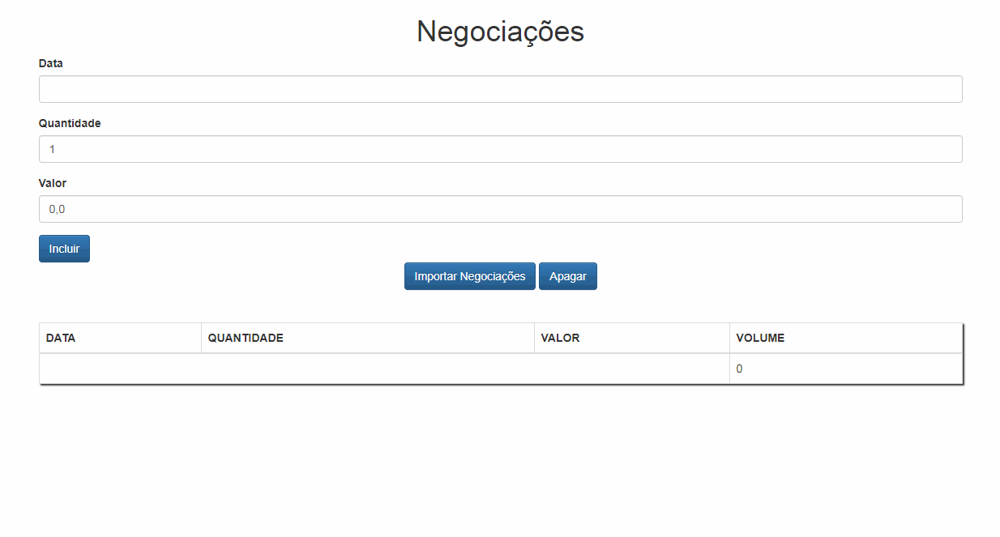

# Framework


> Framework criado a partir do livro [Cangaceiro JavaScript: Uma aventura no sertão da programação](https://www.casadocodigo.com.br/products/livro-cangaceiro-javascript).

## Como utilizar
```sh
$ git clone https://github.com/TacioAntonio/framework-negotiations.git
```

1. Client:
```sh
$ cd framework-negotiations/client
$ npm i
$ npm start
```

2. Server:
```sh
$ cd framework-negotiations/server
$ npm i
$ npm start
```